# 🌐 Federated Learning Playground

> **A comprehensive guide to federated learning concepts, algorithms, and implementations using TensorFlow Federated**

[](https://python.org)
[](https://tensorflow.org)
[](https://tensorflow.org/federated)

## 📚 Table of Contents

1. [Introduction to Federated Learning](#introduction)
2. [Setup and Environment](#setup)
3. [Core Concepts](#core-concepts)
4. [FedAvg Algorithm](#fedavg-algorithm)
5. [Data Heterogeneity (Non-IID)](#data-heterogeneity)
6. [Personalized Federated Learning](#personalized-fl)
7. [Secure Aggregation](#secure-aggregation)
8. [Experimental Results](#results)
9. [Medium Article Series Roadmap](#medium-series)
10. [Further Reading](#further-reading)

---

## 🎯 Introduction {#introduction}

**Federated Learning (FL)** is a revolutionary machine learning paradigm that enables multiple parties to collaboratively train a shared model without centralizing their data. This approach addresses critical privacy, security, and regulatory concerns while leveraging distributed computational resources.

### 🔑 Key Benefits

- **🔒 Privacy Preservation**: Data never leaves the local device/organization
- **📊 Scalability**: Leverages distributed computing across edge devices
- **⚖️ Regulatory Compliance**: Meets GDPR, HIPAA, and other data protection requirements
- **🌍 Global Reach**: Enables training across geographical and organizational boundaries
- **💰 Cost Efficiency**: Reduces data transmission and storage costs

### 🏗️ How Federated Learning Works

```mermaid
graph TD
    A["🌐 Central Server<br/>Global Model"] --> B["📱 Client 1<br/>(Local Data D1)"]
    A --> C["🏥 Client 2<br/>(Local Data D2)"]
    A --> D["🏢 Client 3<br/>(Local Data D3)"]
    A --> E["📊 Client N<br/>(Local Data DN)"]
    
    B --> F["🔄 Local Training<br/>SGD on D1"]
    C --> G["🔄 Local Training<br/>SGD on D2"]
    D --> H["🔄 Local Training<br/>SGD on D3"]
    E --> I["🔄 Local Training<br/>SGD on DN"]
    
    F --> J["📤 Send Updates<br/>Δw1 = w1 - w_global"]
    G --> K["📤 Send Updates<br/>Δw2 = w2 - w_global"]
    H --> L["📤 Send Updates<br/>Δw3 = w3 - w_global"]
    I --> M["📤 Send Updates<br/>ΔwN = wN - w_global"]
    
    J --> N["⚖️ FedAvg Aggregation<br/>w_new = w_old + Σ(nk/n × Δwk)"]
    K --> N
    L --> N
    M --> N
    
    N --> A
```



---

## 🛠️ Setup and Environment {#setup}

This playground includes 5 comprehensive Jupyter notebooks that progressively build your understanding of federated learning:

### 📝 Notebook Overview

| Notebook | Focus | Key Concepts | Dataset |
|----------|-------|--------------|---------|
| `1_setup.ipynb` | **TFF Fundamentals** | Basic FL workflow, TFF API, EMNIST preprocessing | EMNIST |
| `2_fedavg_scratch.ipynb` | **FedAvg Deep Dive** | Algorithm implementation, aggregation schemes | EMNIST |
| `2_fedavg_zExample.ipynb` | **Hyperparameter Study** | Client selection (C), local epochs (E) | EMNIST |
| `3_cifar10_noniid.ipynb` | **Data Heterogeneity** | IID vs Non-IID, Dirichlet distribution | CIFAR-10 |
| `4_personalized_fl.ipynb` | **Personalization** | Global + local fine-tuning | CIFAR-10 |
| `5_secure_agg.ipynb` | **Privacy & Security** | Cryptographic aggregation, mask cancellation | Simulated |

### 🔧 Installation Requirements

```bash
pip install tensorflow tensorflow-federated matplotlib pandas numpy
```

---

## 🧠 Core Concepts {#core-concepts}

### 🎯 Mathematical Foundation

In federated learning, we have:

- **K clients** with local datasets $D_k$ of size $n_k$
- **Global objective**: Minimize $F(w) = \sum_{k=1}^K \frac{n_k}{n} F_k(w)$
- **Local objective** for client $k$: $F_k(w) = \frac{1}{n_k} \sum_{(x,y) \in D_k} \ell(w; x, y)$

Where:
- $w$ represents the global model parameters
- $n = \sum_{k=1}^K n_k$ is the total number of samples
- $\ell(w; x, y)$ is the loss function for a single sample

### 🔄 Federated Learning Workflow

1. **Initialization**: Server initializes global model $w_0$
2. **Client Selection**: Server selects subset $S_t \subseteq \{1, 2, ..., K\}$ of clients
3. **Local Training**: Each client $k \in S_t$ trains locally: $w_t^k \leftarrow \text{LocalUpdate}(k, w_t)$
4. **Model Update**: Clients compute updates $\Delta w_t^k = w_t^k - w_t$
5. **Aggregation**: Server aggregates updates using FedAvg formula
6. **Iteration**: Repeat until convergence

---

## ⚖️ FedAvg Algorithm {#fedavg-algorithm}

**Federated Averaging (FedAvg)** is the foundational algorithm for federated learning, introduced by McMahan et al. (2017).

### 📊 Algorithm Details

```python
def FedAvg(clients, rounds, C, E, B, η):
    """
    clients: set of all clients
    rounds: number of communication rounds
    C: fraction of clients selected per round
    E: number of local epochs
    B: local batch size
    η: learning rate
    """
    w = initialize_model()
    
    for round_t in range(rounds):
        # Client selection
        m = max(C * len(clients), 1)
        S_t = random_sample(clients, m)
        
        # Parallel local training
        updates = []
        for client_k in S_t:
            w_k = LocalUpdate(client_k, w, E, B, η)
            updates.append((client_k.n, w_k - w))
        
        # Weighted aggregation
        total_samples = sum(n for n, _ in updates)
        w = w + sum(n/total_samples * Δw for n, Δw in updates)
    
    return w
```

### 🔢 Mathematical Formulation

The FedAvg aggregation rule is:

$$w_{t+1} = w_t + \sum_{k \in S_t} \frac{n_k}{\sum_{j \in S_t} n_j} \Delta w_t^k$$

Where:
- $w_t$ is the global model at round $t$
- $S_t$ is the set of selected clients at round $t$
- $n_k$ is the number of samples at client $k$
- $\Delta w_t^k = w_t^k - w_t$ is the model update from client $k$

### 🎛️ Aggregation Schemes

Our implementation compares two aggregation strategies:

#### 1. **NUM_EXAMPLES** (Standard FedAvg)
$$w_{t+1} = w_t + \sum_{k \in S_t} \frac{n_k}{\sum_{j \in S_t} n_j} \Delta w_t^k$$

**Pros**: 
- Statistically optimal under IID conditions
- Clients with more data have proportionally more influence

**Cons**: 
- Can bias toward large clients
- Vulnerable to data quality issues from large clients

#### 2. **UNIFORM** (Equal Weighting)
$$w_{t+1} = w_t + \frac{1}{|S_t|} \sum_{k \in S_t} \Delta w_t^k$$

**Pros**:
- Democratic aggregation (all clients equal voice)
- More robust to client size heterogeneity
- Better for non-IID scenarios

**Cons**:
- Ignores data amount differences
- May be suboptimal under IID conditions

### 📈 Hyperparameter Impact

| Parameter | Symbol | Impact on Performance | Typical Values |
|-----------|--------|--------------------|----------------|
| **Clients per Round** | $C$ | Higher C → More stable convergence | 5-100 |
| **Local Epochs** | $E$ | Higher E → Faster per-round progress, more drift | 1-10 |
| **Learning Rate** | $\eta$ | Standard ML tuning applies | 0.01-0.1 |
| **Batch Size** | $B$ | Affects local optimization quality | 16-64 |

---

## 📊 Data Heterogeneity (Non-IID) {#data-heterogeneity}

Real-world federated learning faces **data heterogeneity** where clients have non-identical and non-independent (non-IID) data distributions.

### 🎯 Types of Data Distribution

```mermaid
graph LR
    subgraph IID["🎯 IID Data Distribution"]
        A1["Client 1<br/>📊 All Classes<br/>0,1,2,3,4,5,6,7,8,9"]
        A2["Client 2<br/>📊 All Classes<br/>0,1,2,3,4,5,6,7,8,9"]
        A3["Client 3<br/>📊 All Classes<br/>0,1,2,3,4,5,6,7,8,9"]
    end
    
    subgraph NonIID["⚡ Non-IID Data Distribution"]
        B1["Client 1<br/>🔢 Only: 0,1"]
        B2["Client 2<br/>🔢 Only: 2,3"]
        B3["Client 3<br/>🔢 Only: 4,5"]
        B4["Client 4<br/>🔢 Only: 6,7"]
        B5["Client 5<br/>🔢 Only: 8,9"]
    end
    
    subgraph Dirichlet["🎲 Dirichlet Distribution (α parameter)"]
        C1["α = 0.1<br/>🔴 Highly Skewed<br/>1-2 dominant classes"]
        C2["α = 1.0<br/>🟡 Moderate Skew<br/>Some specialization"]
        C3["α = 10.0<br/>🟢 Nearly Uniform<br/>Balanced distribution"]
    end
```



### 🎲 Dirichlet Distribution for Realistic Non-IID

We use the **Dirichlet distribution** to create realistic data heterogeneity:

$$p_k \sim \text{Dir}(\alpha \mathbf{1})$$

Where:
- $p_k$ is the class probability vector for client $k$
- $\alpha$ controls the concentration (heterogeneity level)
- $\mathbf{1}$ is a vector of ones

#### 🎚️ α Parameter Effects

| α Value | Heterogeneity Level | Client Specialization | Real-World Example |
|---------|-------------------|---------------------|-------------------|
| **α = 0.1** | 🔴 Extreme | 1-2 dominant classes | Specialized hospitals |
| **α = 1.0** | 🟡 Moderate | Some specialization | Regional differences |
| **α = 10.0** | 🟢 Mild | Nearly uniform | Well-mixed datasets |

### 📉 Impact on Performance

**Key Findings from Experiments:**

1. **Convergence Speed**: Non-IID training is ~25-35% slower
2. **Stability**: Non-IID exhibits higher round-to-round variance
3. **Final Performance**: Gap can be 10-20% in final accuracy
4. **Client Drift**: Local models diverge from global optimum

### 🛠️ Mitigation Strategies

| Strategy | Mechanism | Effectiveness |
|----------|-----------|---------------|
| **Increase C** | More clients per round → Better averaging | ✅ High |
| **Decrease E** | Fewer local epochs → Less drift | ✅ Medium |
| **Client Selection** | Strategic sampling | ✅ Medium |
| **Regularization** | Penalize drift from global model | ✅ High |

---

## 🎯 Personalized Federated Learning {#personalized-fl}

**Personalized FL** addresses the limitations of "one-size-fits-all" global models by allowing client-specific adaptations.

### 🔄 Two-Phase Approach

```mermaid
graph TD
    subgraph Phase1["🌐 Phase 1: Global Training"]
        A["Central Server"] --> B["FedAvg Training"]
        B --> C["Global Model w_global"]
    end
    
    subgraph Phase2["🎯 Phase 2: Personalization"]
        C --> D["Client 1<br/>Classes: cats, dogs"]
        C --> E["Client 2<br/>Classes: planes, ships"]
        C --> F["Client 3<br/>Classes: cars, trucks"]
        
        D --> G["Fine-tune on<br/>local cat/dog data"]
        E --> H["Fine-tune on<br/>local plane/ship data"]
        F --> I["Fine-tune on<br/>local car/truck data"]
        
        G --> J["Personalized Model<br/>w1_personal"]
        H --> K["Personalized Model<br/>w2_personal"]
        I --> L["Personalized Model<br/>w3_personal"]
    end
    
    subgraph Results["📊 Results"]
        M["Global: 30% accuracy<br/>❌ Poor on specialized data"]
        N["Personalized: 70% accuracy<br/>✅ Excellent on local data"]
    end
```



### 📐 Mathematical Framework

**Phase 1 - Global Training:**
$$w_{\text{global}} = \arg\min_w \sum_{k=1}^K \frac{n_k}{n} F_k(w)$$

**Phase 2 - Local Personalization:**
$$w_k^{\text{personal}} = \arg\min_w F_k(w) \text{ starting from } w_{\text{global}}$$

### 🎯 Personalization Strategies

| Strategy | Formula | Use Case | Pros/Cons |
|----------|---------|----------|-----------|
| **Fine-tuning** | $w_k \leftarrow w_{\text{global}} - \eta \nabla F_k(w)$ | Limited local data | ✅ Simple / ❌ Overfitting |
| **Meta-learning** | Learn initialization for fast adaptation | Few-shot scenarios | ✅ Principled / ❌ Complex |
| **Multi-task** | $w = [w_{\text{shared}}, w_k^{\text{personal}}]$ | Related tasks | ✅ Balanced / ❌ Architecture changes |

### 📊 Experimental Results

From our CIFAR-10 experiments:

| Metric | Global Model | Personalized Model | Improvement |
|--------|-------------|-------------------|-------------|
| **Average Accuracy** | 32.1% | 65.8% | **+33.7%** |
| **Best Case** | 83.0% | 82.0% | -1.0% |
| **Worst Case** | 0.0% | 74.0% | **+74.0%** |

**Key Insights:**
- Clients with specialized data (2 classes) see dramatic improvements
- Clients with diverse data see minimal gains
- Personalization is most valuable under high heterogeneity

---

## 🔐 Secure Aggregation {#secure-aggregation}

**Secure Aggregation** enables privacy-preserving federated learning by computing the sum of client updates without revealing individual contributions.

### 🔑 Core Principle

```mermaid
graph TD
    subgraph Clients["🔐 Secure Aggregation Protocol"]
        A["Client 1<br/>Update: u1"] --> D["+ Mask M12, M13<br/>- Mask M21, M31"]
        B["Client 2<br/>Update: u2"] --> E["+ Mask M21, M23<br/>- Mask M12, M32"]
        C["Client 3<br/>Update: u3"] --> F["+ Mask M31, M32<br/>- Mask M13, M23"]
    end
    
    subgraph Transmission["📡 Encrypted Transmission"]
        D --> G["Masked Update:<br/>u1 + M12 + M13 - M21 - M31"]
        E --> H["Masked Update:<br/>u2 + M21 + M23 - M12 - M32"]
        F --> I["Masked Update:<br/>u3 + M31 + M32 - M13 - M23"]
    end
    
    subgraph Server["🌐 Server Aggregation"]
        G --> J["Sum all masked updates"]
        H --> J
        I --> J
        J --> K["Masks cancel perfectly!<br/>Result: u1 + u2 + u3"]
    end
```



### 🎭 Pairwise Masking Protocol

**Setup**: Every client pair $(i,j)$ shares a secret seed $s_{ij}$ through secure key exchange.

**Masking Rule**: Client $i$ computes:
$$\text{mask}_i = \sum_{j \neq i} \begin{cases} 
+\text{PRG}(s_{ij}) & \text{if } i < j \\
-\text{PRG}(s_{ij}) & \text{if } i > j
\end{cases}$$

**Masked Update**: $\tilde{u}_i = u_i + \text{mask}_i$

**Server Aggregation**: 
$$\sum_{i=1}^n \tilde{u}_i = \sum_{i=1}^n u_i + \underbrace{\sum_{i=1}^n \text{mask}_i}_{=0}$$

### 🔒 Security Properties

| Property | Guarantee | Explanation |
|----------|-----------|-------------|
| **Correctness** | $\sum \tilde{u}_i = \sum u_i$ | Masks cancel perfectly |
| **Privacy** | Individual $u_i$ remain hidden | Cryptographically masked |
| **Efficiency** | Linear in number of clients | Scalable to large federations |

### ⚠️ Robustness Challenges

**Dropout Problem**: When client $k$ disappears:
- Masks involving $k$ don't cancel: $\pm\text{PRG}(s_{kj})$ remain
- Result: $\sum u_i + \text{noise}$ (completely wrong!)

**Real-world Solutions**:
- **Secret Sharing**: Split each $s_{ij}$ into shares held by multiple clients
- **Threshold Protocols**: Require only $t$ out of $n$ clients for reconstruction
- **Robust Aggregation**: Detect and handle Byzantine clients

---

## 📈 Experimental Results {#results}

### 🔬 Key Findings Summary

#### 1. **FedAvg Hyperparameter Study** (`2_fedavg_zExample.ipynb`)

| Configuration | Final Loss | Convergence Rate | Key Insight |
|---------------|------------|-----------------|-------------|
| C=5, E=1 | 2.30 | Slow | Too few clients → high variance |
| C=5, E=3 | 2.25 | Medium | More local work helps |
| C=10, E=1 | 2.15 | Fast | More clients → stable convergence |
| C=10, E=3 | 2.10 | Fastest | Best balance |

#### 2. **IID vs Non-IID Comparison** (`3_cifar10_noniid.ipynb`)

| Metric | IID | Non-IID (2 classes) | Impact |
|--------|-----|-------------------|--------|
| **Final Loss** | 1.65 | 1.15 | Non-IID actually lower loss |
| **Final Accuracy** | 39.7% | 49.6% | Non-IID higher accuracy |
| **Convergence** | Smooth | Noisy | High variance in Non-IID |
| **Rounds to Target** | 20 | 25-30 | 25-35% slower |

#### 3. **Data Heterogeneity Spectrum** (Dirichlet α)

| α Parameter | Heterogeneity | Final Loss | Convergence Rounds |
|-------------|---------------|------------|-------------------|
| **0.1** | Extreme | 1.45 | 35+ |
| **1.0** | Moderate | 1.35 | 25 |
| **10.0** | Mild | 1.28 | 20 |

#### 4. **Personalized FL Results** (`4_personalized_fl.ipynb`)

**Global vs Personalized Performance:**
- **Average Global Accuracy**: 32.1%
- **Average Personalized Accuracy**: 65.8%
- **Average Improvement**: +33.7 percentage points

**Client-Specific Examples:**
```
Client 1: [dog, truck] → Global: 6.0%, Personalized: 74.0% (+68.0%)
Client 5: [airplane, ship] → Global: 0.0%, Personalized: 68.0% (+68.0%)
Client 15: [horse, ship] → Global: 0.0%, Personalized: 61.0% (+61.0%)
```

### 📊 Performance Patterns

1. **Client Selection (C)**: Higher C stabilizes training, especially under non-IID
2. **Local Epochs (E)**: Benefits diminish under non-IID due to client drift
3. **Data Heterogeneity**: Moderate non-IID can actually improve final performance
4. **Personalization**: Most effective for clients with specialized data distributions

---

## 📝 Medium Article Series Roadmap {#medium-series}

This playground serves as the foundation for a comprehensive Medium article series on federated learning:

### 📚 Planned Article Structure

#### **Article 1: "Federated Learning 101: Training AI Without Sharing Data"**
- **Target**: Beginners, product managers, business stakeholders
- **Content**: Introduction, use cases, basic workflow
- **Notebook**: `1_setup.ipynb`
- **Key Diagrams**: FL workflow, privacy benefits

#### **Article 2: "Deep Dive into FedAvg: The Heart of Federated Learning"**
- **Target**: ML engineers, researchers
- **Content**: Mathematical foundation, implementation details, hyperparameter tuning
- **Notebooks**: `2_fedavg_scratch.ipynb`, `2_fedavg_zExample.ipynb`
- **Key Formulas**: FedAvg aggregation, convergence analysis

#### **Article 3: "The Non-IID Challenge: When Federated Learning Gets Real"**
- **Target**: Advanced practitioners, researchers
- **Content**: Data heterogeneity, Dirichlet distribution, mitigation strategies
- **Notebook**: `3_cifar10_noniid.ipynb`
- **Key Insights**: α parameter effects, convergence trade-offs

#### **Article 4: "Personalized Federated Learning: Best of Both Worlds"**
- **Target**: Applied ML teams, product developers
- **Content**: Two-phase training, fine-tuning strategies, performance gains
- **Notebook**: `4_personalized_fl.ipynb`
- **Key Results**: 33.7% average improvement metrics

#### **Article 5: "Secure Aggregation: Cryptographic Privacy in Federated Learning"**
- **Target**: Security engineers, privacy researchers
- **Content**: Pairwise masking, cryptographic foundations, robustness challenges
- **Notebook**: `5_secure_agg.ipynb`
- **Key Concepts**: Mask cancellation, dropout problem

#### **Article 6: "Differential Privacy in Federated Learning: The Ultimate Privacy Protection"**
- **Target**: Privacy engineers, compliance teams
- **Content**: DP mechanisms, privacy-utility trade-offs, implementation
- **Status**: 🚧 In development
- **Key Concepts**: ε-differential privacy, noise mechanisms

### 🎯 Article Writing Guidelines

1. **Start with Intuition**: Use analogies and visual explanations
2. **Build Mathematical Rigor**: Gradually introduce formal concepts
3. **Include Practical Code**: Provide reproducible implementations
4. **Highlight Real-World Impact**: Connect to industry applications
5. **Address Common Pitfalls**: Share debugging tips and best practices

---

## 📖 Further Reading {#further-reading}

### 📚 Foundational Papers

1. **McMahan et al. (2017)**: "Communication-Efficient Learning of Deep Networks from Decentralized Data" 
   - *The original FedAvg paper*

2. **Bonawitz et al. (2017)**: "Practical Secure Aggregation for Privacy-Preserving Machine Learning"
   - *Secure aggregation foundations*

3. **Li et al. (2020)**: "Federated Optimization in Heterogeneous Networks"
   - *FedProx algorithm for non-IID data*

4. **Karimireddy et al. (2020)**: "SCAFFOLD: Stochastic Controlled Averaging for Federated Learning"
   - *Advanced variance reduction*

### 🔗 Technical Resources

- **TensorFlow Federated**: [Official Documentation](https://www.tensorflow.org/federated)
- **OpenMined**: [Privacy-Preserving ML Community](https://openmined.org)
- **FedML**: [Research Platform](https://fedml.ai)
- **Flower**: [Modern FL Framework](https://flower.dev)

### 🏭 Industry Applications

- **Google**: Gboard keyboard predictions
- **Apple**: Siri voice recognition
- **Healthcare**: Medical imaging, drug discovery
- **Finance**: Fraud detection, credit scoring
- **IoT**: Smart city applications, edge computing

---

## 🤝 Contributing

This playground is designed for educational purposes and serves as a foundation for the upcoming Medium article series. Contributions, suggestions, and feedback are welcome!

### 📧 Contact

For questions about the federated learning implementations or the upcoming article series, please reach out through the project repository.

---

## 📄 License

This project is licensed under the MIT License - see the [LICENSE](../LICENSE) file for details.

---

## 🙏 Acknowledgments

- **TensorFlow Federated Team** for the excellent framework
- **Federated Learning Research Community** for the foundational work
- **Open Source Contributors** who make privacy-preserving ML accessible

---

*Built with ❤️ for the federated learning community*
